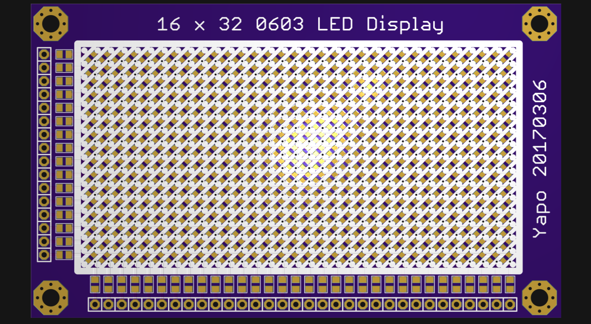
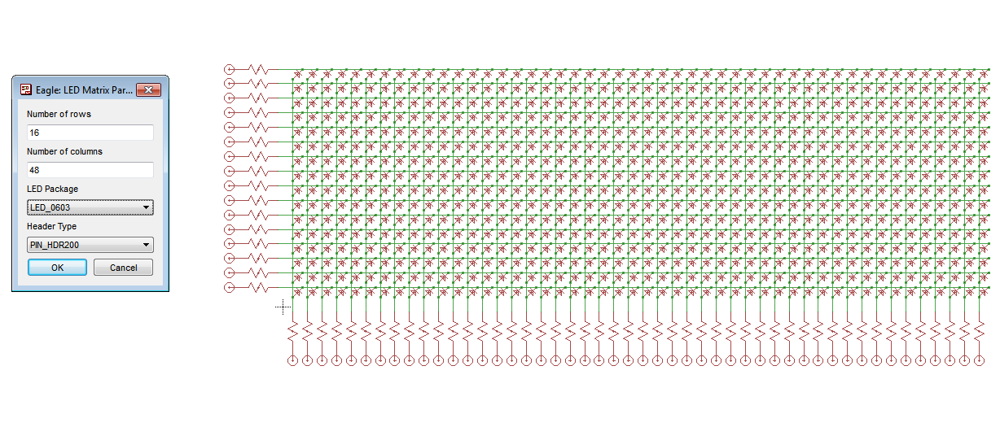
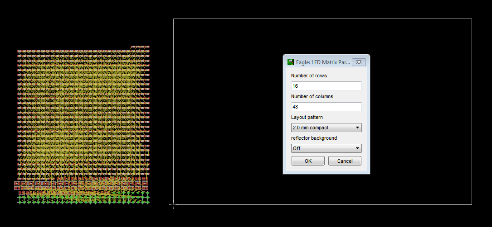
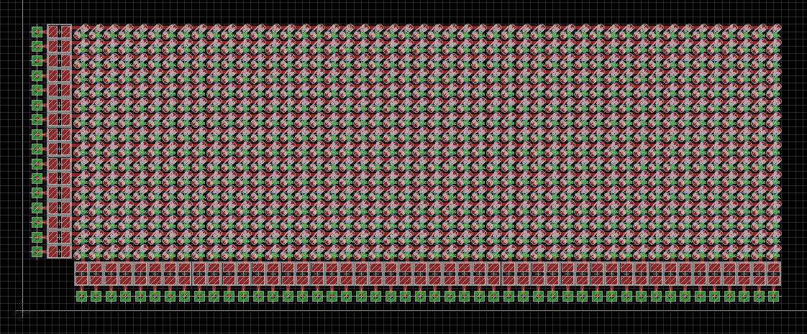

# led-matrix-generator

Eagle ULP scripts for LED matrix display generation (schematic + board).

## Supported Patterns

Currently, the following patterns are supported:

- 2.54 mm, 0603 LEDs, with or without white silkcreen background
- 2.0 mm, 0603 LEDs, without background

2.54 mm pattern example:



## Usage

Step 1:  `RUN led_matrix_schematic.ulp`

Select the desired number of rows, columns and appropriate header type:



The scripts attempt to  `USE '/<path to>/library/led_matrix.lbr';` automatically. 

Step 2: Switch to board view, create board from schematic if needed.

Step 3:  `RUN led_matrix_layout.ulp`

Currently, the choices in the schematic are not stored. Please repeat the appropriate parameters when running the layout ulp script. 



Result (2.0 mm pattern):


 
## Adding New Patterns

These patterns are individually optimized, and new ones can be added in `led_matrix_layout.ulp` and `/ulp` subdirectory:

```c
int patternIdx;
string patterns[] = {
	"2.54 mm classic",
	"2.0 mm compact" };
string cmds[] = {
	"RUN led_matrix_layout_100mil.ulp %d %d %d",
	"RUN led_matrix_layout_2mm.ulp %d %d %d" };
```

Partial design rule files with matching names are located in the `dru/` subdirectory and intended to be merged with existing rules in the board file to control solder mask expansion and via covering. (Tighter layouts are more susceptible to solder wicking).

## Links

 - original repository: https://github.com/tedyapo/led-matrix-generator/
 - 32x16 LED matrix project on Hackaday.io : https://hackaday.io/project/19472-led-oscilloscope-mk-ii/log/52778-16x32-display-design
 - Application: LED Oscilloscope : https://hackaday.io/project/19472-led-oscilloscope-mk-ii